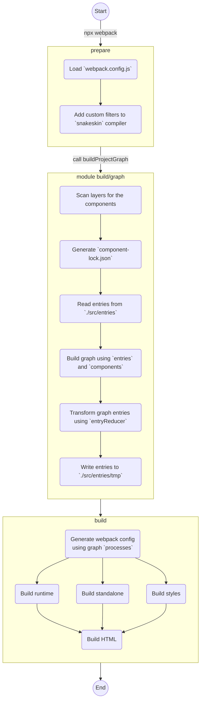

# V4Fire Сборка <!-- omit in toc -->

- [Введение](#введение)
- [Предусловия](#предусловия)
- [Концептуальное описание сборки](#концептуальное-описание-сборки)
  - [Диаграмма сборки](#диаграмма-сборки)
- [Конфигурация](#конфигурация)
- [Граф зависимостей](#граф-зависимостей)
  - [Создание графа зависимостей](#создание-графа-зависимостей)
  - [Параметры компонентов (build/graph/component-params)](#параметры-компонентов-buildgraphcomponent-params)
- [Внешние зависимости в (dist/client/lib)](#внешние-зависимости-в-distclientlib)
- [PZLR](#pzlr)
  - [Модуль block](#модуль-block)
    - [getAll](#getall)
  - [Модуль resolve](#модуль-resolve)
    - [sourceDirs](#sourcedirs)
  - [Модуль entries](#модуль-entries)
    - [getBuildConfig](#getbuildconfig)
    - [getUnionEntryPoints](#getunionentrypoints)
- [Advanced](#advanced)
  - [Особенности сборки snakeskin](#особенности-сборки-snakeskin)
  - [Особенности сборки стилей](#особенности-сборки-стилей)
  - [Сборка fatHTML](#сборка-fathtml)

## Введение

Для сборки используется [`webpack5`](https://webpack.js.org/concepts/)
и [`pzlr`](https://github.com/pzlr/build-core).
Конфигурация сборки и окружения осуществляется с помощью библиотеки [`config`](https://www.npmjs.com/package/config/v/1.31.0).

Для сборки шаблонов используется компилятор [`snakeskin`](https://github.com/SnakeskinTpl/Snakeskin)
и `webpack` загрузчик [`snakeskin-loader`](https://github.com/SnakeskinTpl/snakeskin-loader).

Также мы активно используем препроцессор [`monic`](https://www.npmjs.com/package/monic),
который позволяет в зависимости от параметров окружения вырезать/заменять/добавлять части исходного кода.

## Предусловия

- Ожидается, что проект имеет слои, например для `@v4fire/client` нижележащим слоем является
`@v4fire/core`, это означает, что исходный код при сборке может подключаться
как из директории `./src`, так и из директории `./node_modules/@v4fire/core/src`.
- В корне проекта должен присутствовать файл `.pzlrrc`,
в котором указаны слои проекта (`dependencies`), директория с исходным кодом и иные параметры.
- В корне проекта должен присутствовать файл `.tsconfig`,
при необходимости можно создать файл `client.tsconfig` со специфичными параметрами для сборки.
- В директории `src/entries` должны быть размещены файлы входных точек (`entry`) для `webpack`.

## Концептуальное описание сборки


При запуске `npm run build` создается `tsconfig.json`, а затем вызывается CLI `webpack`.

> У каждого проекта разный набор слоев, поэтому `tsconfig.json` создается динамически,
> с помощью `pzlr` генерируются правильные пути для компилятора TS (`compilerOptions.paths`).

Конфиг `webpack` генерируется автоматически (см. `webpack.config.js`).

Перед генерацией конфига в первую очередь подключается модуль `build/snakeskin`,
который добавляет в `snakeskin` различные
[фильтры](http://snakeskintpl.github.io/docs/guide-ru.html#filters),
а также поддержку импортов из слоев.

Затем с помощью графа зависимостей (`build/graph`) генерируются конфиги сборок `webpack`
(для параллелизации), далее будем их называть процессами.

Каждый процесс отвечает за сборку определенной части проекта: стили, js, html и т.д.

> Граф зависимостей (`build/graph`) играет ключевую роль при сборке, его назначение и функции
> описаны в соответствующем разделе.

В момент построения графа создаются конечные входные точки в директории `src/entries/tmp`,
которые затем будут переданы в качестве параметра `entry` в `webpack`.

> Промежуточные файлы входных точек создаются для того, чтобы оптимизировать импорты стилей,
> шаблонов и исходного кода из слоев проекта.
> Рекурсивно добавляются необходимые `require` согласно указанным
[зависимостям компонента](https://github.com/V4Fire/Client/wiki/Базовое-создание-компонента#indexjs),
> при этом происходит автоматическое разрешение путей к файлам с исходным кодом
> с учетом их местоположения в иерархии слоев.

Для каждого процесса формируется своя конфигурация с помощью модулей,
которые расположены в директории `build/webpack`, названия модулей совпадают
с параметрами конфигурации `webpack`, например: module, alias, output и т.д.

> Стоит обратить внимание, что для импорта модулей используется функция [`include`](https://github.com/V4Fire/Core/blob/v4/build/include.js)
> она ищет модуль по слоям проекта, что позволяет переопределять модули в вышележащих слоях.

Далее осуществляется сборка:
- Шаблоны `snakeskin` компилируются в низкоуровневые команды Vue.
- `stylus` собирается с использованием кастомных плагинов, которые расположены в директории [`build/stylus`](/build/stylus).
- TypeScript собирается с помощью `ts-loader`.

Практически все типы файлов перед сборкой предварительно обрабатываются с помощью `monic`:
- Импорты с использованием `@super` разрешаются относительно нижележащего слоя.
- Разрешает `@context` импорты (см. `components/directives/icon`)
- Преобразовывает динамические импорты компонентов в группу импортов: стилей, шаблонов и исходного кода.
- Подгружает зависимости компонентов: шаблоны, стили и т.д.

### Диаграмма сборки


## Конфигурация

Конфиги проекта расположены в директории `config`.
Как говорилось ранее используется библиотека [`config`](https://www.npmjs.com/package/config/v/1.31.0).
Здесь указываются следующие параметры:

- движок рендера, по-умолчанию: `vue3`
- параметры сборки: режим, кол-во CPU под сборку и др.
- параметры webpack: режим, тип кэширования, SSR сборка и др.
- тема приложения
- параметры стилей, snakeskin, monic и т.д.

Управлять параметрами конфигурации при сборке, можно с помощью флага `--env`,
например:

```
npx webpack --env build-mode=production
```

или с помощью `.env` файла:

```
BUILD_MODE=production
```

или с помощью установки переменной окружения (только для `unix` систем)

```
BUILD_MODE=production npx webpack
```

## Граф зависимостей

Ускоряет сборку за счёт кэширования `webpack` процессов, входных точек и их зависимостей, а также
полного списка компонентов с их расположением на файловой системе.

Граф зависимостей хранится в директории `app-cache/{hash}/graph.json`,
где `hash` - это параметр `build.hash` из конфига проекта.

Он включает в себя 4 поля:
- `entry` - конечные входные точки для сборки `webpack`,
- `processes` - процессы для сборки `webpack`,
- `dependencies` - здесь указаны runtime зависимости входных точек,
- `components` - все компоненты проекта (с учётом родительских слоев),
хранятся в файле `components-lock.json`.

**Информация о компонентах:**

Это хеш-таблица, где ключом является имя компонента, а значением метаданные компонента.
В метаданных указан путь к компоненту на файловой системе.

Данный путь используется при сборке, чтобы избежать чтений с файловой системы.
Это особенно актуально, когда у проекта несколько слоев и поиск файла в каждом слое,
может существенно замедлить сборку.

### Создание графа зависимостей

Граф зависимостей строится непосредственно перед генерацией конфигурации для `webpack`.
В процессе его построения генерируются промежуточные входные точки в `src/entries/tmp`
(см. `entryReducer` в `build/graph`) при помощи функций `getBuildConfig` и `getUnionEntryPoints`
из модуля `entries` библиотеки `pzlr`.

### Параметры компонентов (build/graph/component-params)

`TODO`: описать назначение

## Внешние зависимости в (dist/client/lib)

Внешние зависимости описаны в `src/components/super/i-static-page/deps.js`.
В момент сборки они перемещаются в директорию `dist/client/lib`
и затем подключаются на страницу как отдельные скрипты.

Это сделано для оптимизации сборки за счёт `QUESTION`

## PZLR

`TODO`: описать назначение и функции

### Модуль block

#### getAll

Формирует `component-lock.json` на базе всех компонентов в проекте.

Хэш для файла `components-lock.json` вычисляется:
- на базе `index.js` компонентов всех слоев,
- исходного кода компонентов текущего проекта,
- параметров конфига проекта `build.componentLockPrefix` и `componentDependencies`.

### Модуль resolve

#### sourceDirs

Пути к исходному коду всех слоев проекта. Например:

```JS
// Первый путь не имеет `blocks` на конце, т.к. в файле .pzlrrc `blockDir = ''`
['./src', './node_modules/@v4fire/core/src/blocks']
```

### Модуль entries

#### getBuildConfig

Возвращает метаданные и исходный код входных точек расположенных в `src/entries`.
При необходимости исходный код входных точек обрабатывается с помощью `monic`.

#### getUnionEntryPoints

Вычисляет входные точки и их зависимости на базе входных точек, полученных из `getBuildConfig`.

## Advanced

### Особенности сборки snakeskin

Все шаблоны загружаются в глобальную переменную `TPLS`. Для этого создается отдельная точка входа
в `src/entries/tmp` с расширением `*.ss.js` в которой перечисляются все шаблоны компонентов.

```JS
globalThis.TPLS = globalThis.TPLS || Object.create(null)
Object.assign(TPLS, require('./../../../components/icons/b-progress-icon/b-progress-icon.ss'));
Object.assign(TPLS, require('./../../../components/form/b-button/b-button.ss'));
// ...
```

Загрузка шаблонов реализована таким образом, потому что `QUESTION`.

При загрузке `*.ts` файлов с помощью специального `monic` заменителя
`attach-component-dependencies` добавляются `require` для загрузки шаблонов
под именем компонента в исходный код.

```JS
TPLS['b-select'] = require("./src/components/form/b-select/b-select.ss")["b-select"];
```
**Важно!** данная операция не применяется если включена `fatHTML` сборка

`QUESTION`: не совсем понятно зачем повторно подключать шаблон в TPLS в runtime, если
есть входная точка с расширением `*.ss.js`.

Исходный код шаблона компилируется в набор низкоуровневых Vue команд, для этого используется
snakeskin loader (см. `build/webpack/module.js`).

### Особенности сборки стилей

Для написания стилей компонента мы используем язык [`stylus`](https://github.com/stylus/stylus),
а также плагин собственной разработки
[`stylus-inheritance`](https://github.com/pzlr/stylus-inheritance/tree/master), который
добавляет функциональность наследования.

`TODO`

### Сборка fatHTML

Все ресурсы добавляются напрямую в HTML страницу - мы это называем толстым HTML.

Регулируется через конфиг (см. `webpack.fatHTML`), если следующие режимы сборки:

- 0 - отключено
- 1 - только скрипты и ссылки встраиваются в страницу
- 2 - все ресурсы встраиваются в страницу (`QUESTION`: похоже, что он не работает)

