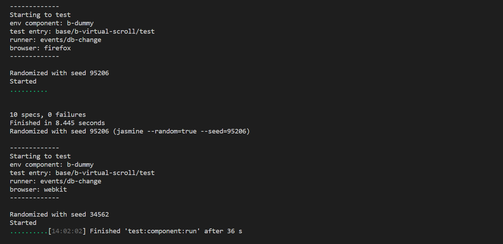

# V4 component and module testing tools



## Test environment

* Test runner – [Jasmine](https://jasmine.github.io)
  * Please read the section [asynchronous tests](https://jasmine.github.io/tutorials/async)

* [Playwright](https://playwright.dev/) is used to launch headless browsers

## Creating a test file

First, you need to create the test file itself. Create a folder with the name `test` within your component with an `index.js` file.

```
.
└── src/
  └── base/
    └── b-popover/
      ├── test/
      │   └── index.js
      ├── b-popover.ss
      ├── b-popover.styl
      ├── b-popover.ts
      └── index.js
```

## Setting up the test environment

To prepare the environment for tests, you need to make an initial configuration:

* Enable mocks;
* Allow geolocation;
* etc.

There is a function `h.utils.setup` for this, open the file` index.js` and call this function:

**base/b-popover/test/index.js**

```js
// @ts-check

const
  h = include('tests/helpers');

/**
 * @param {Playwright.Page} page
 * @param {!Object} params
 * @returns {!Promise<void>}
 */
module.exports = async (page, params) => {
  await h.utils.setup(page, params.context);
};
```

> Note the `// @ ts-check` – thanks to this directive works static code analysis within javascript files.

This code enables data mocks and asks for required permissions.

## Creating components at runtime

The first step to create your component during test execution is to add the component as a dependency for a demo page:

**pages/p-demo-page/index.js**

```js
package('p-v4-components-demo')
  .extends('i-root')
  .dependencies('b-popover');
```

To render a component dynamically during runtime, you should use `renderComponents`. The method places globally and has a signature:

```typescript
export interface RenderParams {
  /**
   * Component attrs
   */
  attrs: Dictionary;

  /** @see [[RenderContent]] */
  content?: Dictionary<RenderContent | string>;
}

/**
 * Content to render into an element
 *
 * @example
 *
 * ```typescript
 * globalThis.renderComponents('b-button', {
 *   attrs: {
 *      testProp: 1
 *   },
 *
 *   content: {
 *     default: {
 *       tag: 'b-button',
 *       content: {
 *         default: 'Test'
 *       }
 *     }
 *   }
 * });
 * \```
 *
 * This schema is the equivalent of such a template:
 *
 * ```ss
 * < b-button :testProp = 1
 *   < b-button
 *     Test
 * \```
 */
export interface RenderContent {
  /**
   * Component name or tagName
   */
  tag: string;

  /**
   * Component attrs
   */
  attrs: Dictionary;

  /** @see [[RenderContent]] */
  content?: Dictionary<RenderContent | string>;
}

/**
 * Renders specified components
 *
 * @param componentName
 * @param scheme
 * @param options
 */
declare var renderComponents: (componentName: string, scheme: RenderParams[], options?: RenderOptions) => void;
```

The `schema` contains a list of parameters to render, i.e., each element represents a component to render.

Let's draw our first component on the page, first of all create a `render.js` file in which we will place the rendering scheme.

**base/b-popover/test/render.js**

```js
module.exports = [
  {
    attrs: {
      id: 'without-slots'
    }
  }
];
```

Let's import this file to our main test file and call the render function:

**base/b-popover/test/index.js**

```js
// @ts-check

const
  h = include('tests/helpers');

const
  scheme = include('src/base/b-popover/test/render.js');

/**
 * @param {Playwright.Page} page
 * @param {!Object} params
 * @returns {!Promise<void>}
 */
module.exports = async (page, params) => {
  await h.utils.setup(page, params.context);

  await page.evaluate((scheme) => {
    globalThis.renderComponents('b-popover', scheme);
  }, scheme);

  const
    bPopover = await h.component.getComponentById(page, 'without-slots');
};
```

The `b-popover` component is now in the DOM tree and ready to interact.

> Note that a component may not be in a ready state, i.e., `globalThis.renderComponents` creates a component and immediately
>places it into a DOM tree, without waiting for the ready status or anything else.

After creating the component, you can directly start testing; let's make the first spec.

**base/b-popover/test/index.js**

```js
module.exports = async (page, params) => {
  await h.utils.setup(page, params.context);

  await page.evaluate((scheme) => {
    globalThis.renderComponents('b-popover', scheme);
  }, scheme);

  const
    bPopover = await h.component.getComponentById(page, 'without-slots');

  describe('bPopover', () => {
    it('has correct componentName', async () => {
      const componentName = await bPopover.evaluate((ctx) => ctx.componentName);
      expect(componentName).toBe('b-popover');
    });
  });
};
```

> Now, we can run our test, but we will talk about this a little later, and now we will continue to write the test.

Each spec runs on the same page, and no automatic state updates are provided. So it's always worth keeping in mind that updating a
state of components on the page is in your hands.

To update a state of components, you can use several approaches for your taste (but I would recommend the manual reset since it is faster).
Let's look at each of them separately:

* `Manual reset` – the method involves manually clearing a state of components on the page, for example,  by using the `beforeEach` hook.

* `Page reload` – the method involves reloading the page, as a result of which the page state will be "clean" every time.

Let's write the second spec and add refreshing of the page's components using the `manual reset` strategy.

**base/b-popover/test/index.js**

```js
module.exports = async (page, params) => {
  await h.utils.setup(page, params.context);

  let
    bPopover,
    bPopoverNode;

  beforeEach(async () => {
    await page.evaluate((scheme) => {
      globalThis.removeCreatedComponents();
      globalThis.renderComponents('b-popover', scheme);
    }, scheme);

    bPopover = await h.component.getComponentById(page, 'without-slots'),
    bPopoverNode = await page.$('#without-slots');
  });

  describe('bPopover', () => {
    it('has correct componentName', async () => {
      const componentName = await bPopover.evaluate((ctx) => ctx.componentName);
      expect(componentName).toBe('b-popover');
    });

    it('shown when calling `open`', async () => {
      await bPopover.evaluate((ctx) => ctx.open());
      expect(await bPopoverNode.evaluate((ctx) => ctx.style.display)).not.toBe('none');
    });
  });
};
```

Take a look at what happens in the code above: we have added the `beforeEach` hook. This hook invokes two methods from the global scope of the page.

1. `beforeEach` is executed before each spec in the file.
2. `removeCreatedComponents` removes all components from the page that were created using the` renderComponents` method.
3. `renderComponents` creates a new component and puts it into the page.

Thus, we have a new component instance for each spec.

Finally, we can run our tests:

```bash
npx gulp test:component --runtime-render true --test-entry base/b-popover/test
```

The execution result should be:

```bash
-------------
Starting to test
env component: b-dummy
test entry: base/b-popover/test
runner: undefined
browser: firefox
-------------

Randomized with seed 61427
Started
..

2 spec, 0 failures
Finished in 0.054 seconds
```

## Working with pre-compiled components

Above we looked at how to create components dynamically at the runtime, but there is another way that is mainly used to build `demo` component pages.

This method allows you to get a test page with necessary components using a standalone compilation of test-cases.
Just create a `demo.js` file within your component folder and puts a scheme of rendering within it.

**base/b-popover/demo.js**

```js
const demo = [
  {
    attrs: {
      id: 'target'
    }
  }
];

const analytics = [
  {
    attrs: {
      ':redirect': '() => false',
      id: 'target'
    }
  },

  {
    attrs: {
      ':redirect': '() => false',
      ':theme': s('demo'),
      id: 'without-slots'
    }
  }
];

const suits = {
  demo,
  analytics
};
```

Such a file can have several different suits. According to these suits (depending on the passed parameter `suit`) will be generated components at the page.

> Note that this schema format is different from the schema format of `renderComponents`.

You can get a component in a test as follows:

**base/b-popover/test/index.js**

```js
module.exports = async (page, params) => {
  await h.utils.setup(page, params.context);

  const
    bPopover = await h.component.getComponentById(page, 'without-slots');

  describe('bPopover', () => {
    it('has correct componentName', async () => {
      const componentName = await bPopover.evaluate((ctx) => ctx.componentName);
      expect(componentName).toBe('b-popover');
    });
  });
};
```

> Please note that the component is not removed or cleared between specs, the management of this completely falls on the shoulders of a developer.

Run test:

```bash
npx gulp test:component --name b-popover --suit demo
```

## Splitting specs

You can split your specs into different files and run them separately.
To do this, create the `runners` folder into the `test` folder. Now, you allow adding your spec files to this folder.

**base/b-popover/test/runners/initializing.js**

```js
module.exports = async (page, params) => {
  let
    bPopover,
    bPopoverNode;

  beforeEach(async () => {
    await page.evaluate((scheme) => {
      globalThis.removeCreatedComponents();
      globalThis.renderComponents('b-popover', scheme);
    }, scheme);

    bPopover = await h.component.getComponentById(page, 'without-slots'),
    bPopoverNode = await page.$('#without-slots');
  });

  describe('bPopover initializing', () => {
    it('has correct componentName', async () => {
      const componentName = await bPopover.evaluate((ctx) => ctx.componentName);
      expect(componentName).toBe('b-popover');
    });
  });
};
```

**base/b-popover/test/runners/behaviour.js**

```js
module.exports = async (page, params) => {
  let
    bPopover,
    bPopoverNode;

  beforeEach(async () => {
    await page.evaluate((scheme) => {
      globalThis.removeCreatedComponents();
      globalThis.renderComponents('b-popover', scheme);
    }, scheme);

    bPopover = await h.component.getComponentById(page, 'without-slots'),
    bPopoverNode = await page.$('#without-slots');
  });

  describe('bPopover behaviour', () => {
    it('shown when calling `open`', async () => {
      await bPopover.evaluate((ctx) => ctx.open());
      expect(await bPopoverNode.evaluate((ctx) => ctx.style.display)).not.toBe('none');
    });
  });
};
```

The main test file should contain an initializer of specs.

**base/b-popover/test/index.js**

```js
// @ts-check

/**
 * @typedef {import('playwright').Page} Page
 */

const
  h = include('tests/helpers'),
  u = include('tests/utils'),
  test = u.getCurrentTest();

/**
 * Starts a test
 *
 * @param {Page} page
 * @param {!Object} params
 * @returns {!Promise<boolean>}
 */
module.exports = async (page, params) => {
  await h.utils.setup(page, params.context);
  return test(page);
};
```

To run a runner provide its name within a command.

```bash
npx gulp test:component --runtime-render true --test-entry base/b-popover/test --runner behaviour
npx gulp test:component --runtime-render true --test-entry base/b-popover/test --runner initializing
```

Also, you can use glob patterns to define several runners.

```bash
npx gulp test:component --runtime-render true --test-entry base/b-popover/test --runner "*"
npx gulp test:component --runtime-render true --test-entry base/b-popover/test --runner "**/*"
npx gulp test:component --runtime-render true --test-entry base/b-popover/test --runner "behaviour/*"
```

## Testing modules

To test some module or directive, you can add it into the `b-dummy` component or a `demo` page. For example,  the `in-view` directive:

**base/b-dummy/b-dummy.ts**

```typescript
const
  inViewMutation = inViewFactory('mutation'),
  inViewObserver = inViewFactory('observer');

@component()
export default class bDummy extends iData {
  /**
   * Links to directives
   */
  get directives(): Directives {
    return {
      inViewMutation,
      inViewObserver
    };
  }
}
```

Later, you will be able to access modules through the component.

Running a module test using the `in-view` example:

```bash
npx gulp test:component --name b-dummy --test-entry core/dom/in-view/test
```

## Running tests with different options

Build a `demo` page with components and attributes from` suit: demo`, and then run the test located at `b-popover/test.js`
or` b-popover/test/index.js`:

```bash
npx gulp test:component --name b-popover --suit demo
```

Build a `demo` page with `b-dummy` and then run the test located at the specified `test-entry`:

```bash
npx gulp test:component --runtime-render true --test-entry base/b-popover/test
```

Run (without building) the test located at `test-entry`:

```bash
npx gulp test:component:run --runtime-render true --test-entry base/b-popover/test
```

Run (without building) the test located at the `test-entry` address only in the `chromium` browser:

```bash
npx gulp test:component:run --runtime-render true --test-entry base/b-popover/test --browsers chromium
```

Run all tests defined in `cwd/tests/cases.js`:

```bash
npx gulp test:components
```

Runs all tests defined in `cwd / tests / cases.js`, maximum 4 builds, and two tests can be run in parallel:

```bash
npx gulp test:components --test-processes 2 --build-processes 4
```

To make your test run during the call to `test:components`, you need to add it to a file with test cases.
This file is located by an address `cwd/tests/cases.js`. It looks something like this:

```js
module.exports = [
  // b-router
  '--test-entry base/b-router/test',

  // b-virtual-scroll
  '--test-entry base/b-virtual-scroll/test --runner slots/empty',

  // b-button
  '--test-entry form/b-button/test',

  // in-view
  '--test-entry core/dom/in-view/test'
];
```

`cases.js` should export an array of strings containing the parameters with which the test should be run.

> Please note that neither `name` nor `runtime-render` appears anywhere, because when calling `test:components`, all test parameters are checked.
> If the test does not have the `--name` parameter, the `--runtime-render true` will be set automatically.
