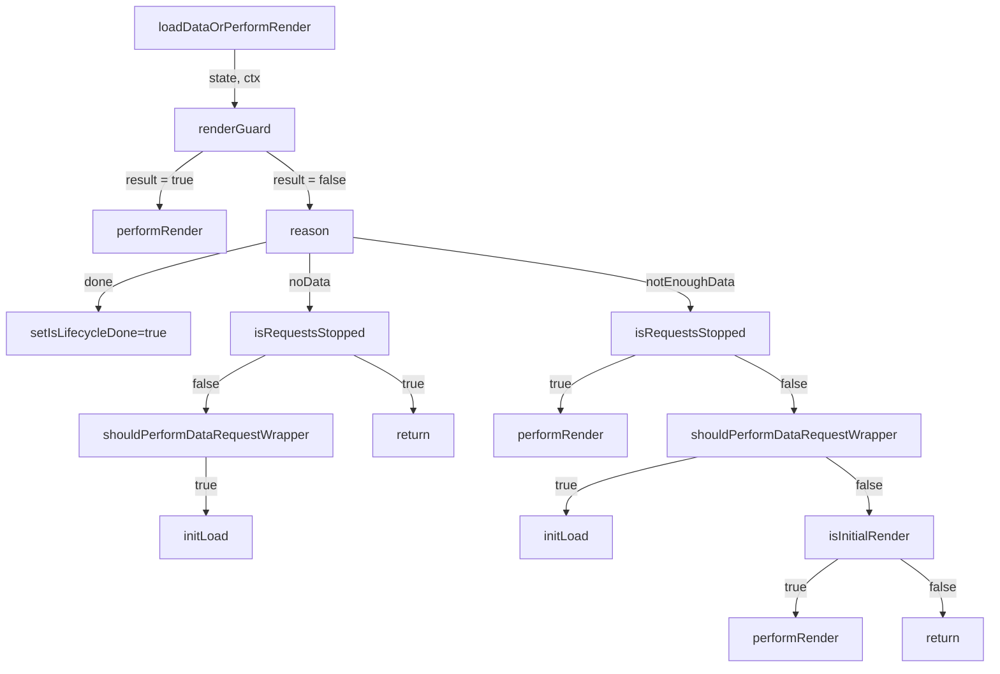

- ~~Загруженных данных может не хватит на отрисовку поэтому прятать лоадер можно только когда набралось нужное кол-во данных~~ -> неактуально
- PartialRender ? Если указано к отрисовке 10 компонентов а загружено за раз данных 5 - рисовать ли эти 5 и потом еще 5 -> для версии 1.1.0
- ~~Подумать над форматом данных к отрисовке, раньше клиент получал 10 элементов данных и должен был вернуть 10 элементов к отрисовке~~ -> Реализовано
- Preload нескольких страниц -> есть ли нужда?
- Обработка ошибок тесты
- Проверка стейта во время ошибок
- typedLocalEmitter можно ли избавиться и как-то нормально типизировать события компонента
- ~~кейс: загрузили чанк отрисовали -> загружаем следующий (он грузится 20 сек) -> пока грузится полный скролл внизу -> запрещаем загрузку и переходим в isDone состояние -> данные загрузились -> что произойдет???~~ -> неактуально
- ~~componentInternalState.setLoadingPage(val) -> componentInternalState.set('loadingPage', val);~~ -> неактуально
- ~~стоит ли для state использовать builder like подход~~ -> неактуально
- ~~негативные тест кейсы~~ -> реализовано
- улучшить имена интерфейсов (MountedItem, MountedSeparator, ревью имен в ComponentState)
- протыкать все метода на использование (удалить неиспользуемые)
- улучшить имена тест кейсов
- ревью и рефакторинг src\components\base\b-scrolly\test\api\helpers\index.ts
- dbChange
- описать что состояние типа loadPage, renderPage обновляются постфактум (после того как загрузка данных случилась, после того как рендеринг случился)
- ~~лишний вызов shouldStopRequestingData в onDataLoadSuccess~~ -> исправлено
- поддержка onRequestError?
- обработка async replace error в initLoad
- не нравится проверка .then((res) => if (res == null) {this.onDataLoadError()})



## TODO:

1. Бенчмарк подходов

## Идеи

1. При скролле брать оффсет скролла и бинарным поиском искать элементы которые сейчас на экране должны быть и отображать их

```typescript
		const vdomCreate: typeof this['vdom']['create'] = this.vdom.create.bind(this.vdom);
		const self = this;

		setNodes.forEach((node) => node.remove());

		if (!vueInstance) {
			vueInstance = new Vue({
				render: function () {
					const nodes = getArray(count).map((data: DummyUser) => vdomCreate('b-dummy-user', {
						attrs: {
							dummyData: data,
							key: data.userId,
						}
					}));

					// const nodes = vdomCreate('keep-alive', {
					// 	attrs: {},
					// 	children: {
					// 		default: () => getArray(count).map((data) => ({
					// 			type: 'b-dummy-user',
					// 			attrs: {
					// 				dummyData: data,
					// 				key: data.userId,
					// 			}
					// 		}))
					// 	}
					// })

					return nodes;
				},

				beforeCreate() {
					let parent = self;
					if (parent != null) {
						const
							root = Object.create(parent.$root);

						Object.defineProperty(root, '$remoteParent', {
							configurable: true,
							enumerable: true,
							writable: true,
							value: parent
						});

						Object.defineProperty(this, 'unsafe', {
							configurable: true,
							enumerable: true,
							writable: true,
							value: root
						});
					}
				}
			});

			const
				container = document.createElement('div');

			mountResult = vueInstance.mount(container);

			const
				el = this.block?.element('container');
				el?.append(container);

		} else {
			mountResult.$forceUpdate();
		}

		this.nextTick(() => {
			Array.from(document.querySelectorAll('.b-dummy-user')).forEach((el) => {
				if (setNodes.has(el)) {
					return;
				}

				setNodes.add(el);
				el.component._forkDestroy = el.component.$destroy;

				Object.defineProperty(el.component, '$destroy', {
					configurable: true,
					enumerable: false,
					writable: true,
					value: () => {
						return false;
					}
				});

			});
		});

		console.log(setNodes);
```