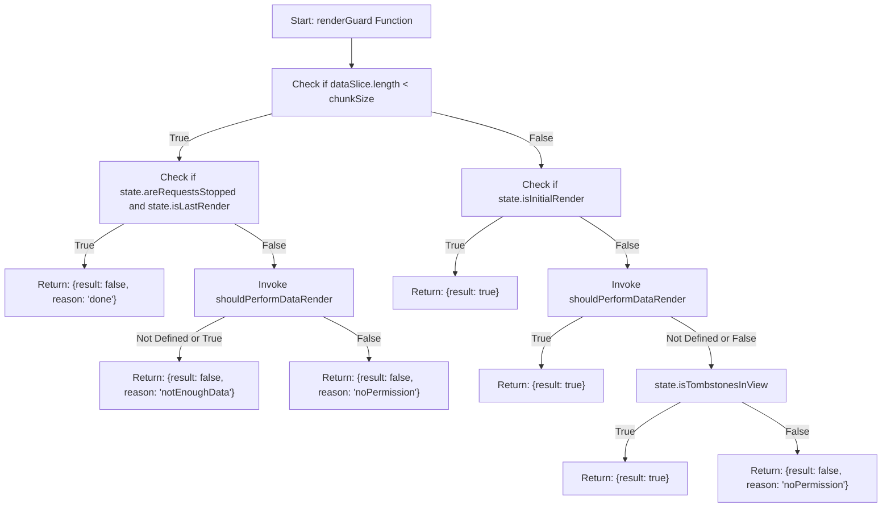
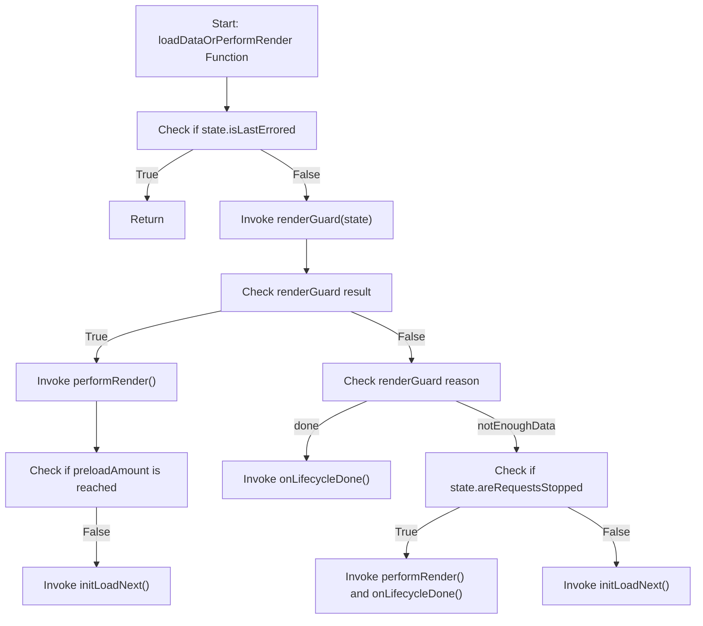

<!-- START doctoc generated TOC please keep comment here to allow auto update -->
<!-- DON'T EDIT THIS SECTION, INSTEAD RE-RUN doctoc TO UPDATE -->
**Table of Contents**

- [components/base/b-virtual-scroll-new](#componentsbaseb-virtual-scroll-new)
  - [Synopsis](#synopsis)
  - [Modifiers](#modifiers)
  - [Events](#events)
  - [Usage](#usage)
    - [How to Implement Simple Rendering via DataProvider?](#how-to-implement-simple-rendering-via-dataprovider)
    - [How to Implement Simple Rendering via `items`?](#how-to-implement-simple-rendering-via-items)
    - [How to Implement Component Rendering on Click Instead of Scroll?](#how-to-implement-component-rendering-on-click-instead-of-scroll)
    - [How to Reinitialize the Component?](#how-to-reinitialize-the-component)
    - [How to Reload a Failed Request?](#how-to-reload-a-failed-request)
    - [Component State](#component-state)
    - [Converting Data to the Required Format](#converting-data-to-the-required-format)
    - [Sliders or Multi-Column Content](#sliders-or-multi-column-content)
    - [How to Use "Should-Like" Functions?](#how-to-use-should-like-functions)
      - [Overview of Functions](#overview-of-functions)
      - [Best Practices](#best-practices)
    - [Control the Rendering Conveyor with `itemsFactory`](#control-the-rendering-conveyor-with-itemsfactory)
    - [`itemsProcessors` and Global Component Processing](#itemsprocessors-and-global-component-processing)
    - [`request` and `requestQuery`](#request-and-requestquery)
    - [Component Understanding](#component-understanding)
      - [Lifecycle](#lifecycle)
      - [`renderGuard` and `loadDataOrPerformRender`](#renderguard-and-loaddataorperformrender)
      - [Performing Last Render](#performing-last-render)
      - [Difference between ComponentItem with type `item` and `separator`](#difference-between-componentitem-with-type-item-and-separator)
      - [Overriding in Child Layers](#overriding-in-child-layers)
    - [Frequently Asked Questions](#frequently-asked-questions)
  - [Slots](#slots)
  - [API](#api)
    - [Props](#props)
      - [\[shouldPerformDataRender = `(state: VirtualScrollState) => state.isInitialRender || state.remainingItems === 0`\]](#shouldperformdatarender--state-virtualscrollstate--stateisinitialrender--stateremainingitems--0)
      - [\[shouldStopRequestingData = `(state: VirtualScrollState) => state.lastLoadedData.length > 0`\]](#shouldstoprequestingdata--state-virtualscrollstate--statelastloadeddatalength--0)
      - [\[chunkSize = `10`\]](#chunksize--10)
      - [\[requestQuery\]](#requestquery)
      - [\[itemsFactory\]](#itemsfactory)
      - [\[itemsProcessors = `{}`\]](#itemsprocessors--)
      - [\[preloadAmount = `0`\]](#preloadamount--0)
      - [`tombstoneCount`](#tombstonecount)
    - [Methods](#methods)
      - [getNextDataSlice](#getnextdataslice)
      - [getVirtualScrollState](#getvirtualscrollstate)
      - [initLoadNext](#initloadnext)
    - [Other Properties](#other-properties)
  - [Migration from `b-virtual-scroll-new` version 3.x.x](#migration-from-b-virtual-scroll-new-version-3xx)
    - [API Migration](#api-migration)
  - [What's Next](#whats-next)
    - [Streaming Data Rendering](#streaming-data-rendering)
    - [Alternative Approach to Component Rendering](#alternative-approach-to-component-rendering)
    - [Partial Rendering (can be achieved easily through `renderGuard`)](#partial-rendering-can-be-achieved-easily-through-renderguard)
    - [Updating Nodes in the DOM Tree (describe implementation challenges, component allows inserting different components)](#updating-nodes-in-the-dom-tree-describe-implementation-challenges-component-allows-inserting-different-components)
    - [Integration with RTX](#integration-with-rtx)

<!-- END doctoc generated TOC please keep comment here to allow auto update -->

# components/base/b-virtual-scroll-new

The `b-virtual-scroll-new` component is designed for rendering a large array of various data.
It uses a special approach that renders chunks of components while avoiding changes to the parent component's state.
This allows for optimizing the rendering of large lists of components, making it more efficient.
If you have ever tried to render 100 components using v-for, you may have noticed that the interface starts to lag.
The `b-virtual-scroll-new` component aims to eliminate this lag by rendering components in portions, providing a better alternative to using v-for for such cases.

## Synopsis

- The component extends [[iData]].

- The component implements [[iItems]] traits.

- By default, the component's root tag is set to `<div>`.

## Modifiers

See the implemented modifiers or the parent component.

## Events

| EventName           | Description                                             | Payload description                         | Payload                    |
|---------------------|---------------------------------------------------------|---------------------------------------------|----------------------------|
| `dataLoadSuccess`   | Data loading has succeeded.                             | `data: object[], isInitialLoading: boolean` | `[data, isInitialLoading]` |
| `dataLoadStart`     | Data loading has started.                               | `isInitialLoading: boolean`                 | `[isInitialLoading]`       |
| `dataLoadError`     | An error occurred while loading data.                   | `isInitialLoading: boolean`                 | `[isInitialLoading]`       |
| `dataLoadEmpty`     | Successful load with no data.                           |                                             | `[]`                       |
| `resetState`        | Reset component state.                                  |                                             | `[]`                       |
| `lifecycleDone`     | All component data is rendered and loaded.              |                                             | `[]`                       |
| `convertDataToDB`   | Trigger data conversion to the `DB`.                    | `data: unknown`                             | `[data]`                   |
| `elementEnter`      | The element has entered the viewport.                   | `componentItem: MountedChild`               | `[componentItem]`          |
| `renderStart`       | Rendering of items has started.                         |                                             | `[]`                       |
| `renderDone`        | Rendering of items has finished.                        |                                             | `[]`                       |
| `renderEngineStart` | Rendering of items has started with the render engine.  |                                             | `[]`                       |
| `renderEngineDone`  | Rendering of items has finished with the render engine. |                                             | `[]`                       |
| `domInsertStart`    | DOM node insertion has started.                         |                                             | `[]`                       |
| `domInsertDone`     | DOM node insertion has finished.                        |                                             | `[]`                       |

Also, you can see the implemented traits or the parent component.

## Usage

The component offers various usage options: it can load and render data on scroll, on click, or even load a large volume of data at once but render it in portions. Would you like to implement a global rendering process for components in order to integrate a specific element (e.g., an advertisement) after each component? No problem - the component provides processor functions that enable this functionality. Do you want to implement your own strategy for "when to load" and "when to render"? The component also offers special functions that allow for this customization.

Below, we will explore a few basic usage scenarios and delve into the component's API in greater detail.

### How to Implement Simple Rendering via DataProvider?

To implement simple rendering, you need to follow several steps:

1. Set up a data provider for the component. For example, we'll use a provider named `Provider` that returns data in the format `{data: object[]}`, where the number of objects depends on the request parameter `count`:

   ```snakeskin
   < b-virtual-scroll-new &
     :dataProvider = 'Provider'
   .
   ```

   > It's important to note that `b-virtual-scroll-new` expects data in this specific format (`{data: object[]}`). If your provider returns data in a different format, you can use processors in either the provider or the component using the `convertDataToDb` prop.

2. Let's say we want to load and render 12 components at a time. To achieve this, you need to specify the `request` and `chunkSize` props for the `b-virtual-scroll-new` component. The `request` prop defines the request parameters (standard behavior of `iData`), and `chunkSize` specifies the number of items to render in each rendering cycle:

   ```snakeskin
   < b-virtual-scroll-new &
     :dataProvider = 'Provider' |
     :request = {get: {count: 12}} |
     :chunkSize = 12
   .
   ```

3. To avoid loading the same data repeatedly and load different data for each subsequent request, you need to pass the `page` request parameter to the `Provider`. This parameter indicates the page number of the data to be loaded:

   To achieve this, use the `requestQuery` prop in the `b-virtual-scroll-new` component. `requestQuery` is a function prop that `b-virtual-scroll-new` calls, passing its own state as an argument, before making a request. You can return the appropriate `page` value based on the component's state. The difference between `request` and `requestQuery` is that changes to the latter won't cause the component to reinitialize. These two props are merged to form the final request parameters passed to the provider.

   ```snakeskin
   < b-virtual-scroll-new &
     :dataProvider = 'Provider' |
     :request = {get: {count: 12}} |
     :requestQuery = (state) => ({get: {page: state.loadPage}}) |
     :chunkSize = 12
   .
   ```

   In the example above, the `page` parameter is extracted from the component's state, specifically `loadPage`, which increments after each successful data load.

4. Now that you have set up data loading with pagination, you need to specify what `b-virtual-scroll-new` will render:

   To control what `b-virtual-scroll-new` renders, you can use the following props:

   - `item`: The name of the component to be rendered. It can also be a function that returns the component's name.

   - `itemProps`: The props for the component. Typically, this is a function that returns the props for each item based on the loaded data.

   - `itemKey`: The uniq id of the component.

   Rendering occurs after data is loaded.

   ```snakeskin
   < b-virtual-scroll-new &
     :dataProvider = 'Provider' |
     :request = {get: {count: 12}} |
     :requestQuery = (state) => ({get: {page: state.loadPage}}) |
     :chunkSize = 12 |
     :item = 'b-dummy' |
     :itemKey = (el) => el.uuid |
     :itemProps = (el) => ({name: el.name, type: el.type})
   .
   ```

   What is `el` you can inquire about in the `itemKey` and `itemProps` functions? `el` is one of the objects in the `data` array loaded by the `dataProvider`. `b-virtual-scroll-new` takes the array of loaded data and calls these functions for each of the objects in this array, allowing you to transform data into components that are suitable for rendering in the `b-virtual-scroll-new` component.

This setup will display a component on the page that loads and renders 12 items at once. When scrolling down, a new request with a different `page` value will be made, and after a successful load, new components will be rendered.

However, if your component takes a long time to load data (e.g., 1 second), you might notice that there is initially empty space, and then the content suddenly appears, which can be unexpected for users. To avoid this, `b-virtual-scroll-new` provides slots that allow you to render a "loader" while data is being loaded.

Let's add a `loader` slot to our component to provide a better user experience during loading:

```snakeskin
< b-virtual-scroll-new &
  :dataProvider = 'Provider' |
  :request = {get: {count: 12}} |
  :requestQuery = (state) => ({get: {page: state.loadPage}}) |
  :chunkSize = 12 |
  :item = 'b-dummy' |
  :itemProps = (el) => ({name: el.name, type: el.type})
.
  < template #loader
    < .&__loader
      Data loading in progress
```

Now, users will see a friendly message indicating that content will appear shortly, preventing them from being surprised by sudden content changes.

### How to Implement Simple Rendering via `items`?

The approach to rendering data using the `items` prop is not significantly different from the approach when data is obtained from a `dataProvider`.

Instead of passing the `dataProvider` and request* parameters,
you need to pass the items prop which contains an array of data to be rendered by the components:

   ```snakeskin
   < b-virtual-scroll-new &
     :chunkSize = 12 |
     :items = data |
     :item = 'b-dummy' |
     :itemKey = (el) => el.uuid |
     :itemProps = (el) => ({name: el.name, type: el.type})
   .
   ```

   These data can be loaded by some other component or they can be static.
   It doesn't matter, what's important is that the `b-virtual-scroll-new` component will take these data and process them through the rendering pipeline.

There are also some minor differences in the component's event model.
Unlike `b-virtual-scroll-new` which uses a `dataProvider`, a component with items will not emit certain events, specifically `dataLoadStart` and `convertDataToDB`.

The component will also ignore the `shouldStopRequestingData` prop, as they have no meaning when there is no `dataProvider`.

### How to Implement Component Rendering on Click Instead of Scroll?

The `b-virtual-scroll-new` component, in addition to scroll-based loading, can also load data on other events, such as a click on a button.

To implement this approach, follow these steps:

1. Disable scroll observers using the `disableObserver` prop by setting it to `true`.

   ```snakeskin
   < b-virtual-scroll-new &
     :dataProvider = 'Provider' |
     :disableObserver = true |
     ...
   .
   ```

2. Set the `shouldPerformDataRender` prop to a function that always returns `true`. This function will be called for each attempt to render data. We will discuss this function in more detail in the following sections.

   ```snakeskin
   < b-virtual-scroll-new &
     :dataProvider = 'Provider' |
     :disableObserver = true |
     :shouldPerformDataRender = () => true |
     ...
   .
   ```

3. Gain access to the methods of `b-virtual-scroll-new` using the standard `ref` mechanism.

   ```snakeskin
   < b-virtual-scroll-new &
     ref = scroll |
     :dataProvider = 'Provider' |
     :disableObserver = true |
     :shouldPerformDataRender = () => true |
     ...
   .
   ```

   After these manipulations, `b-virtual-scroll-new` will no longer load data on scroll, and data loading will only occur when the `initLoadNext` method is called. This method will be used to load and render data on a button click event.

4. Now, you need to add a button that triggers the `initLoadNext` method when clicked.

   ```snakeskin
   < b-virtual-scroll-new &
     ref = scroll |
     :dataProvider = 'Provider' |
     :disableObserver = true |
     :shouldPerformDataRender = () => true |
     ...
   .

   < b-button &
     @click = $refs.scroll.initLoadNext
   .
     Load more data
   ```

Now, when you click the button, data will be loaded and rendered. However, you may notice that the data loading button doesn't disappear when all data is loaded, during data loading, or in case of an error. Fortunately, `b-virtual-scroll-new` provides a slot for displaying such a button, and it handles the logic of hiding it during loading, errors, and so on. Clients don't need to implement additional logic; you just need to move your button to the appropriate slot, specifically the `renderNext` slot.

```snakeskin
< b-virtual-scroll-new &
  ref = scroll |
  :dataProvider = 'Provider' |
  :disableObserver = true |
  :shouldPerformDataRender = () => true |
  ...
.

  < template #renderNext
    < b-button &
      @click = $refs.scroll.initLoadNext
    .
      Load more data
```

Now, your button will be displayed only when there's more data to load, and it will automatically hide during data loading and in case of any errors.

### How to Reinitialize the Component?

There are often situations where you need to redraw all the data that was rendered using `b-virtual-scroll-new`. For example, additional filtering may have been applied, making previously rendered data in `b-virtual-scroll-new` outdated.

In such cases, the component provides several ways to reinitialize it. This allows you to clear the state to its initial state, effectively removing previously rendered components and resetting the state. After the state is reset, the component will start its lifecycle as if it were created from scratch. Let's explore the options for resetting the state.

1. Updating the `request` prop.

2. Triggering an event in the `globalEmitter` from the following list:
   - `reset`
   - `reset.silence`
   - `reset.load`
   - `reset.load.silence`

   This means the component will automatically reload when any of these events are triggered (standard `iData` logic).

3. Calling the `reload` or `initLoad` method.

In which cases should you use each option?

If you have filters on the page and a data request that should be rendered using `b-virtual-scroll-new`, the `request` prop is the most suitable option. You can set the `request` prop to reference the current filter state. This way, when the filter state changes on the page, the component will be automatically reinitialized.

Let's consider an example:

**p-page.ts**

```typescript
@component()
class pPage extends iDynamicPage {
  @field()
  filterUuid: string;

  onFilterClick(newFilter: string): void {
    this.filterUuid = newFilter;
  }
}
```

**p-page.ss**

```snakeskin
< b-virtual-scroll-new &
  :dataProvider = 'Provider' |
  :request = {get: {count: 12, filter: filterUuid}} |
  ...
.
```

In this example, when the `filterUuid` field on the `pPage` changes, `b-virtual-scroll-new` will perform reinitialization and reload the data.

If you need to update the component's state at a specific moment in time, regardless of the context, you can use the `reload` or `initLoad` methods.

### How to Reload a Failed Request?

Did your data fail to load due to a network or server error? No worries! The `initLoadNext` method comes to the rescue, allowing you to retry the failed request.
In addition to the `initLoadNext` method, `b-virtual-scroll-new` provides a `retry` slot that is displayed only when the request fails.

This makes it straightforward to implement a retry mechanism for a failed request:

```snakeskin
< b-virtual-scroll-new &
  :dataProvider = 'Provider' |
  :request = {get: {count: 12, filter: filterUuid}} |
  ...
.
  < template #retry
    < .&__retry @click = initLoadNext
      Retry last request
```

### Component State

The `b-virtual-scroll-new` component is quite substantial and has its own internal state that complements the component's state. This internal state is reset when the component is reinitialized to its initial state and changes regularly during the component's lifecycle. The component's state contains a wealth of information useful for the client, such as the loaded data, the number of elements remaining outside the user's viewport, and more.

To retrieve the component's state, you can use a special method called `getVirtualScrollState`:

**p-page.ts**

```typescript
@component()
class pPage extends iDynamicPage {
  declare protected readonly $refs: {
    scroll: bVirtualScrollNew;
  };

  getScrollState(): VirtualScrollState {
    return this.$refs.scroll.getVirtualScrollState();
  }
}
```

This method returns the current "internal" state of the component.

### Converting Data to the Required Format

The `b-virtual-scroll-new` component expects data in a specific format:

```typescript
interface VirtualScrollDb {
  data: unknown[];
}
```

The `data` array should contain the data items used to render the components.
The `dbConverter` prop allows you to convert data into a format suitable for `b-virtual-scroll-new` after data has been loaded.

```snakeskin
< b-virtual-scroll-new &
  ...
  :dbConverter = (data) => ({data: data.nestedData.data})
.
  < template #loader
    < .&__loader
      Data loading in progress
```

### Sliders or Multi-Column Content

Sometimes, there is a need to render a large amount of data not in a typical vertical strip where one item follows another, but, for example, in a strip consisting of multiple columns or in a slider.

All of these can be implemented using HTML/CSS layout and providing CSS classes in `b-virtual-scroll-new`.
There is no need to specify any additional props for `b-virtual-scroll-new`. For `b-virtual-scroll-new`, the content layout doesn't matter.

### How to Use "Should-Like" Functions?

#### Overview of Functions

The component provides several "should-like" props that determine whether to perform certain actions. Each of these functions serves a different purpose and is called at a specific moment in time. Let's take a detailed look at each of these functions and their purposes:

- `shouldStopRequestingData`: This function indicates the need to stop requesting data and tells the component that the data loading lifecycle has completed. If it returns `true`, the `b-virtual-scroll-new` component will not attempt to request more data until the component is reinitialized, which leads to an update of the lifecycle. This function is called after every successful data load.

  An example implementation of this function could be to check whether the number of loaded items equals the total number of items that can be returned by the pagination for the current query:

  ```typescript
  const shouldStopRequestingData = (state: VirtualScrollState): boolean => {
    // Example: Stop requesting data when the total number of items equals the current number of loaded items
    return state.lastLoadedRawData?.total === state.data.length;
  };
  ```

  The default implementation checks whether anything was loaded in the last request and, if so, allows requests to continue:

  ```typescript
  const shouldStopRequestingData = (state: VirtualScrollState, _ctx: bVirtualScrollNew): boolean => {
    const isLastRequestNotEmpty = () => state.lastLoadedData.length > 0;
    return isLastRequestNotEmpty();
  };
  ```

- `shouldPerformDataRender`: This function indicates the need to render the loaded data. If it returns `true`, the `b-virtual-scroll-new` component will call the component rendering functions and insert them into the DOM tree. This function is called when there is loaded but unrendered data.

  An example implementation of this function could be to check how many items are left before reaching the end of the component's container:

  ```typescript
  const shouldPerformDataRender = (state: VirtualScrollState, _ctx: bVirtualScrollNew): boolean => state.remainingItems === 0;
  ```

  The default implementation is similar to the example above.

#### Best Practices

Here are some tips for efficiently implementing data loading on the client side while providing a seamless user experience:

- Load data well in advance before you intend to render it. Data loading can be slow, but rendering data is much faster. Therefore, it is recommended to start data loading significantly in advance and perform rendering closer to the end of the scroll. This way, users will experience a smoother scrolling of the component.

  For example, you can implement this approach as follows:

  ```snakeskin
  // Set `preloadAmount` prop for the component so that it loads data in advance
  < b-virtual-scroll &
    // ...
    :preloadAmount = 30
  .
  ```

  ```typescript
  const shouldPerformDataRender = (state: VirtualScrollState, _ctx: bVirtualScrollNew): boolean => {
    // Start rendering when only 2 components are left to the end
    return state.remainingItems <= 2;
  }
  ```

- Avoid making the last useless request: This pertains to the `shouldStopRequestingData` function. By default, this function check the last data chunk to see if it returned anything. It's better to avoid this and inform the component in advance that all data has been loaded. You can achieve this by comparing the value returned by your server, indicating the total number of items with the current number of items in `b-virtual-scroll`, as demonstrated in the example above.

### Control the Rendering Conveyor with `itemsFactory`

`itemsFactory` is a prop that allows you to take control of component rendering. Suppose you want to render twice as many components for a single data slice. Achieving this using `iItems` props (`item`, `itemProps`, etc.) might not be possible. However, such situations may arise, and this prop is created to solve them.

Let's consider a scenario in which we need to add a date separator component before each component with a different date from the next one. To achieve this, we will create an implementation of `itemsFactory` in which:

1. We will access the `b-virtual-scroll-new` state to retrieve the loaded data.
2. We will take the previous element to determine if their dates differ, indicating whether we need to insert a date separator.
3. We will assemble an array with an abstract representation of the components to be rendered and return it from `itemsFactory`.

```typescript
const itemsFactory = (state, ctx) => {
  const
    lastLoadedData = state.lastLoadedData,
    allData = state.data,
    items = [];

  lastLoadedData.forEach((current, i) => {
    const
      dataIndex = state.dataOffset + i,
      // Retrieve the previous data element relative to the given
      prev = allData[dataIndex - 1],
      // Retrieve the next data element relative to the given
      next = allData[dataIndex + 1];

    if (!prev || prev.date !== current.date) {
      items.push({
        item: 'b-date-separator',
        key: current.uuid + 'separator',
        type: 'separator',
        children: [],
        props: {
          date: current.date
        }
      });
    }

    items.push({
      item: 'b-main-item',
      key: current.uuid,
      type: 'item',
      children: [],
      props: {
        data: current
      }
    });
  });

  return items;
}
```

As you can see in the example above, we access the last chunk of loaded data and all component data to find the previous and next data elements relative to the current one. Then, we compare their dates, and if they are not equal, we add the `b-date-separator` component before adding the `b-main-item`. This way, we collect the components to be rendered in an array and return it from the `itemsFactory` function.

### `itemsProcessors` and Global Component Processing

This prop is a middleware function that is called after `b-virtual-scroll-new` has compiled the abstract representation of components, and before it passes this representation to the rendering engine. Each function in the chain receives the result of the previous function, with the first function in the chain receiving the result of the `itemsFactory` call. The function should return an abstract representation of components that conforms to the `ComponentItem[]` interface.

Here is an example to illustrate when `itemsProcessors` is called:

-> itemsFactory -> **itemsProcessors** -> render components via render engine -> insert components into the DOM tree

With this prop, you can implement various scenarios, such as changing one component to another, adding components, prop migrations, and more. For some scenarios, you can also use global overrides if you need to implement some processing for all `b-virtual-scroll-new` instances in your application. To add a global processor, you can override the `itemsProcessors` constant located in `base/b-virtual-scroll-new/const.ts` within your codebase and add a function to it.

Here's an example scenario where we need to change the name of one component to another:

**@v4fire/client/components/base/b-virtual-scroll-new/const.ts**

```typescript
export const itemsProcessors: ItemsProcessors = {};
```

**your-project/components/base/b-virtual-scroll-new/const.ts**

```typescript
import { itemsProcessors } from '@v4fire/client/components/base/b-virtual-scroll-new/const.ts'

export const itemsProcessors: ItemsProcessors = {
  ...itemsProcessors,

  migrateCardComponent: (items: ComponentItem[]) => {
    return items.map((item) => {
      if (item.item === 'b-card') {
        console.warn('Deprecation: b-card is deprecated.');

        return {
          ...item,
          props: convertProps(item.props),
          item: 'b-mega-card'
        };
      }

      return item;
    });
  }
};
```

> It's important to note that `itemsProcessors` functions cannot be asynchronous.

Let's also look at another common scenario:

**Task**: Add advertising components after certain components throughout the entire application.

**Solution**: Instead of manually defining the `itemsFactory` function in multiple places to call a pre-prepared function, you can:

   1. Establish an agreement with clients to mark the components before or after which advertising should be displayed using meta information of the component's abstract representation (`ComponentItem`), which will be passed from the client to the component via the `itemMeta` prop:

      ```snakeskin
       < b-virtual-scroll-new &
         // ...
         :itemMeta = (data) => ({ads: data.component === 'b-card' ? 'after' : false})
       .
      ```

   2. Implement a global `itemsProcessor` that will add advertisements based on the metainformation.

      ```typescript
      import { itemsProcessors } from '@v4fire/client/components/base/b-virtual-scroll-new/const.ts'

      export const itemsProcessors: ItemsProcessors = {
        ...itemsProcessors,

        addAds: (items: ComponentItem[]) => {
          const newItems: ComponentItem[] = [];

          const adsComponent = {
            item: 'b-ads',
            key: current.uuid + 'ads',
            type: 'item',
            children: [],
            props: {
              // ...
            }
          }

          return items.map((item) => {
            const itemsToPush = [];
            itemsToPush.push(item);

            if (item.meta.ads === 'after') {
              itemsToPush.push(adsComponent);
            }

            if (item.meta.ads === 'before') {
              itemsToPush.unshift(adsComponent);
            }

            newItems.push(...itemsToPush);
          });

          return newItems;
        }
      };
      ```

After these steps, a neighboring advertising component will be added to all components with the appropriate `meta.ads` value.

It is also perfectly valid to do without using global processing itemsProcessors.
To achieve this, you just need to avoid overriding the constant and instead pass processors as props:

   ```typescript
   class MyPageComponent {
    get itemsProcessors() {
      return [
        (items: ComponentItem[]) => {
          const newItems: ComponentItem[] = [];

          const adsComponent = {
            item: 'b-ads',
            key: current.uuid + 'ads',
            type: 'item',
            children: [],
            props: {
              // ...
            }
          }

          return items.map((item) => {
            const itemsToPush = [];
            itemsToPush.push(item);

            if (item.meta.ads === 'after') {
              itemsToPush.push(adsComponent);
            }

            if (item.meta.ads === 'before') {
              itemsToPush.unshift(adsComponent);
            }

            newItems.push(...itemsToPush);
          });

          return newItems;
        }
      ]
    }
   }
   ```

### `request` and `requestQuery`

To pass query parameters from the `b-virtual-scroll-new` component to the data provider, two props are specified: `request` and `requestQuery`. But why are there two of them, and what is the difference between them? Let's break it down:

- `request` is a prop inherited from `iData`. When the value of this prop changes, it triggers the `initLoad` method. In the case of `b-virtual-scroll-new`, this is interpreted as a need to reset the component's state to its initial state and start a new lifecycle from scratch. In essence, `request` represents static request parameters for one lifecycle of the component. This prop is suitable for parameters that directly affect the need to invalidate the `b-virtual-scroll-new` state.

- `requestQuery` is a prop defined by `b-virtual-scroll-new`. One key difference from `request` is that this prop can be a function, and whatever is returned from this function will be set as query parameters. This prop is used to implement pagination. It takes the "internal" state of `b-virtual-scroll-new` as input and returns query parameters. Changing this prop does not lead to the reinitialization of the component.

The `request` prop and the result of calling the `requestQuery` function are merged together and then passed to the data provider as query parameters.

### Component Understanding

#### Lifecycle

The component's lifecycle consists of several events and states. When the component is initialized and starts its initial data loading, it emits two events: `initLoadStart` and `dataLoadStart`. The `initLoadStart` event is a standard event emitted by every component and occurs each time the component's data is initially loaded. The `dataLoadStart` event is emitted for every data loading.

1. `initLoadStart` - The initial data loading of the component has started.
2. `dataLoadStart` - The data loading of the component has started.

After successful data loading, the following events are emitted:

1. `convertDataToDB` - The data conversion has been performed.
2. `initLoad` - The initial data loading of the component has completed.
3. `dataLoadSuccess` - The data loading of the component has completed.

When the `convertDataToDB` event is emitted, the component's state is already updated with the `lastLoadedRawData` field. The `initLoad` and `dataLoadSuccess` events are emitted after updating the component's state, including `VirtualScrollState.data`, `VirtualScrollState.loadPage`, and some other fields.

After successful data loading, the component consults the `shouldStopRequestingData` method to determine whether it should stop loading further data.

Next, the component invokes the `renderGuard` to determine if the data can be rendered or not. If the `renderGuard` allows rendering, the following events are emitted:

1. `renderStart` - The component rendering has started.
2. `renderEngineStart` - The component rendering using the rendering engine has started.
3. `renderEngineDone` - The component rendering using the rendering engine has completed.
4. `domInsertStart` - The DOM insertion has started.
5. `domInsertDone` - The DOM insertion has completed. This event is asynchronous as it uses RAF (Request Animation Frame) for DOM insertion.
6. `renderDone` - The component rendering has finished.

**The first chunk of elements is rendered synchronously using `v-for`. This is because SSR does not have access to the DOM API required for `vdom`.
Therefore, we leverage Vue functionality to render the first chunk equally for SSR and CSR.**

Afterward, the component waits for user actions, specifically when the user sees any component on the page.
The component then calls the `shouldPerformDataRender` function on the client side.
This process repeats until all data has been loaded and rendered.

`shouldPerformDataRequest` or `shouldPerformDataRender` functions on the client side, depending on the availability of data. This process repeats until all data has been loaded and rendered.

1. `lifecycleDone` - Occurs when all data has been loaded and rendered on the page.

#### `renderGuard` and `loadDataOrPerformRender`

The `b-virtual-scroll-new` component relies on the `renderGuard` and `loadDataOrPerformRender` functions to determine whether to render data, load data, or complete the component's lifecycle.

The `loadDataOrPerformRender` function is the entry point for the data loading and rendering cycle.
This function consults the `renderGuard`, which determines whether data can be rendered based on the data state and provides reasons for rejection only if it has not permitted the rendering.

Understanding `renderGuard`:



Understanding `loadDataOrPerformRender`:



#### Performing Last Render

The `b-virtual-scroll-new` component adheres to a strategy where it always performs a "final" rendering.
This final rendering is always triggered after the client has indicated that data requests are complete (`shouldStopRequestingData`) and the data for rendering is nearing its end or has been exhausted.
To inform the client that the current rendering cycle is the last, the component sets the `isLastRender` flag in its state to `true` before the `renderStart` event and before initiating the rendering cycle, as well as before calling `itemsFactory` and `itemsProcessors`.

Let's consider a scenario where this can be useful. Suppose we need to render 10 items at a time, and after all data has been loaded and rendered, we need to add an advertising block.
Imagine a situation where our provider initially responds with an array of 10 items, and then with an array of 0 items. If our `shouldStopRequestingData` strategy returns `true` when the provider returns less than 10 items, the `b-virtual-scroll-new` component will still attempt to render, even without data. This rendering will occur with the `isLastRender` flag set to `true`.
The actual rendering through rendering engines will only happen if the chain of `itemsFactory` -> `itemsProcessors` returns components for rendering; otherwise, no rendering will occur.
Also, if no rendering occurs, certain events such as `renderEngine*` and `domInsert*` will not be emitted, as there is nothing to render or insert.
This approach guarantees that the client will always have the opportunity to insert something at the end of the feed. Below is a demonstration of this approach:

```typescript
@component()
class pPage {
  shouldStopRequestingData(state: VirtualScrollState): boolean {
    return state.lastLoadedData < 10;
  }

  itemsFactory(state: VirtualScrollState): ComponentItem[] {
    const items: ComponentItem[] = state.lastLoadedData.map((itemData, index) => {
      return {
        type: 'item',
        item: 'section',
        props: {
          id: `element-${index}`
        },
        key: `item-${index}`,
        children: []
      };
    });

    if (state.isLastRender) {
      items.push({
        type: 'item',
        item: 'button',
        props: {
          id: `lastElement`
        },
        key: `lastElement`,
        children: []
      })
    }

    return items;
  }
}
```

This example demonstrates the `b-virtual-scroll-new` component's capability to handle a final rendering phase, even when the incoming data stream has been exhausted. This flexibility allows for dynamic and versatile implementations, like adding a unique element at the end of a list, ensuring a seamless and user-centric experience.

#### Difference between ComponentItem with type `item` and `separator`

The component allows rendering two types of components:

- `item` - Main component (main content).
- `separator` - Other components, such as dividers or separators.

There is no significant difference between them, except that they are treated differently in fields like `remainingItems` in the `VirtualScrollState`. As the name suggests, the `remainingItems` property only considers components with the `item` type, while `remainingChildren` considers components with both `item` and `separator` types.

The distinction between `item` and `separator` types is mainly used for calculating certain properties based on the type of components present in the `VirtualScrollState`, such as the number of items till the end of the scroll.

#### Overriding in Child Layers

The main use case for overriding in child layers is to modify the default behavior of functions or methods.

For example, it may be useful to override the logic of `shouldStopRequestingData` if you want to implement a default logic that takes into account the `total` field of the response when making a decision.

There may also be situations where you need to modify the `renderGuard`. Currently, the component loads data until the number of items reaches the `chunkSize` and then renders them. By overriding the `renderGuard`, you can achieve partial rendering, where the component renders the available data regardless of whether it reaches the `chunkSize`.

### Frequently Asked Questions

- How to assign a class to components rendered within `b-virtual-scroll-new`?

  To achieve this, you need to include the `class` field in the props of the component that should be rendered. You can do this by returning it from the `itemProps` function, like this:

  ```typescript
  const itemProps = (this: bMyComponent) => ({
    // ...
    class: this.provide.classes({'virtual-scroll-item': true})
  })
  ```

- Can I set `chunkSize` to 10 if the request returns 89 items at a time?

  Yes, you can. `b-virtual-scroll-new` will render the data in chunks until it has rendered all of it.

- Can I set `chunkSize` to 10 if the request returns 5 items at a time?

  Yes, you can. `b-virtual-scroll-new` will make requests (one at a time!) until the number of loaded items is greater than or equal to the value specified in `chunkSize`.

- Can I render a different number of items on each render cycle?

  Yes, you can. `b-virtual-scroll-new` provides two options:

    1. Specify the `chunkSize` prop as a function that returns a number depending on something. Let’s say we want to render 6 elements at the first render, 12 at the second, and 18 in subsequent ones:

        ```typescript
        const chunkSize = (state: VirtualScrollState) => [6, 12, 18][state.renderPage] ?? 18
        ```

    2. Use the `itemsFactory` prop and return any number of elements from this function.

- Suppose I want to load 1000 data items once and not make any more requests. How can I achieve this?

  1. Set `chunkSize` to a suitable value, for example, 10, if you want 10 components to be rendered in one rendering cycle.

  2. Set up `dataProvider` and request parameters.

  3. Set the `shouldStopRequestingData` function to always return `true`.

  After these manipulations, `b-virtual-scroll-new` will load the data using `dataProvider` once and then render all the loaded data in chunks.

- Data loading is complete, but the components are not rendering. Why could this happen?

  1. Ensure that your data has a format suitable for `b-virtual-scroll-new`, specifically `{data: any[]}`. If your data has a different format, you can convert it using the `dbConverter` prop, which should return the transformed data, or convert the data in another location, such as in the provider's post-processor.

  2. Make sure that your `should-*` functions are correctly defined, and their conditions are met.

  3. Ensure that your component is included in the bundle in the `index.js` file of your page or component.

  4. Verify that there are no errors in specifying the component's name in the `item` prop and no issues with props in `itemProps`.

- The same components are being rendered multiple times in a row. Why could this happen?

  1. Ensure that you implement pagination using request parameters, and possibly the `requestQuery` prop. You might be loading the same data repeatedly because the request parameters are not changing.

  2. If you have overridden `itemsFactory` and are managing the data rendering flow yourself, ensure that there are no errors in the data slice you are using for rendering.

## Slots

The component supports several slots for customization:

1. The `loader` slot allows you to display different content (usually skeletons) while the data is being loaded:

   ```snakeskin
   < b-virtual-scroll-new
     < template #loader
       < .&__loader
         Data loading in progress
   ```

2. The `tombstone` slot allows you to display different content (usually skeletons) that will be repeated `tombstoneCount` times while the data is being loaded:

   ```snakeskin
   < b-virtual-scroll-new :tombstoneCount = 3
     < template #tombstone
       < .&__skeleton
         Skeleton
   ```

3. The `retry` slot allows you to display different content (usually a prompt to retry loading data) when there is an error in data loading:

   ```snakeskin
   < b-virtual-scroll-new
     < template #retry
       < .&__retry @click = initLoadNext
         Retry last request
   ```

4. The `empty` slot allows you to display different content when the component receives an empty data set during the initial loading:

   ```snakeskin
   < b-virtual-scroll-new
     < template #empty
       < .&__empty
         No data
   ```

5. The `done` slot allows you to display different content when the component has finished loading and rendering all the data. The `done` slot
will be displayed after `lifecycleDone` event is fired:

   ```snakeskin
   < b-virtual-scroll-new
     < template #done
       < .&__done
         Load and render complete
   ```

6. The `renderNext` slot allows you to display different content when the component is not loading data and has not entered the lifecycle completion state.
This slot can be useful when implementing lazy content rendering on button click:

   ```snakeskin
   < b-virtual-scroll-new
     < template #renderNext
       < .&__render-next
         Render next
   ```

## API

### Props

#### [shouldPerformDataRender = `(state: VirtualScrollState) => state.isInitialRender || state.remainingItems === 0`]

This function is called in the `bVirtualScrollNew.renderGuard` after other checks are completed.
It receives the component state as input and determines whether the component should render the next chunk of components.
The function should return a boolean value: `true` to allow the rendering of the next chunk, or `false` to prevent it.

Example usage:

```typescript
const shouldPerformDataRender = (state: VirtualScrollState): boolean => {
  return state.isInitialRender || state.remainingItems === 0;
};
```

#### [shouldStopRequestingData = `(state: VirtualScrollState) => state.lastLoadedData.length > 0`]

This function is called on each data loading cycle. It determines whether the component should stop requesting new data.
The function should return a boolean value: `true` to stop requesting data, or `false` to continue requesting data.

Here's an example of how you can use `shouldStopRequestingData`:

```typescript
const shouldStopRequestingData = (state: VirtualScrollState): boolean => {
  // Example: Stop requesting data when the total number of items equals the current number of loaded items
  return state.lastLoadedRawData?.total === state.data.length;
};
```

In this example, the function compares the total property of `lastLoadedRawData` with the length of the data array.
If the two values are equal, it returns true to indicate that the component should stop requesting new data.
This condition suggests that all available items have been loaded, and there is no need for further data requests.

You can customize the `shouldStopRequestingData` function to fit your specific scenario.
By implementing this function, you have control over when the component should stop requesting new data, based on the comparison between the total number of items and the current number of loaded items.

#### [chunkSize = `10`]

The amount of data required to perform one cycle of item rendering. This prop is used by the `bVirtualScrollNew` component to determine the number of components to render in each cycle.
It can be either a fixed number or a function that returns the number dynamically based on the component state.

Here are some examples:

```typescript
const chunkSize = (state: VirtualScrollState): number => {
  // Example 1: Incrementing chunk size for each render page
  return (state.renderPage + 1) * 10;

  // Example 2: Dynamic chunk size based on the state
  // Replace the condition and calculation with your custom logic
  if (state.isInitialRender) {
    return 20;
  } else if (state.renderPage < 3) {
    return 15;
  } else {
    return 10;
  }
};
```

In Example 1, the chunk size increases by 10 for each render page. For the initial render, it will be 10, then 20, 30, and so on.
In Example 2, the chunk size is dynamically determined based on the component state. It assigns different chunk sizes based on different conditions.

By using a function for `chunkSize`, you have the flexibility to adjust the rendering behavior based on the state of the component and other factors.

#### [requestQuery]

- Type: `Function`
- Default: `undefined`

A function that returns the GET parameters for a request. This function is called for each request and receives the current component state as input.
It should return an object containing the request parameters. These parameters will be merged with the parameters from the `request` prop, giving priority to the `request` prop.

Pagination example:

```typescript
const requestQuery = (state: VirtualScrollState): Dictionary<Dictionary> => {
  return {
    get: {
      page: state.loadPage,
      limit: 10
      // Other pagination parameters
    }
  };
};
```

#### [itemsFactory]

A factory function used to generate an array of `ComponentItem` objects representing the components to be rendered.
This function is called during the rendering process and receives the component state and context as arguments. It should return an array of `ComponentItem` objects.

The default implementation uses the `chunkSize` and `iItems` trait props to slice the data and generate the components.
However, you can override this function to implement a custom rendering strategy.

Here's an example of how you can use the itemsFactory property to generate ComponentItem objects based on the `lastLoadedData` property:

```typescript
const itemsFactory = (state: VirtualScrollState): ComponentItem[] => {
  const items: ComponentItem[] = state.lastLoadedData.map((itemData, index) => {
    // Construct a ComponentItem object for each item in the lastLoadedData array
    return {
      type: 'item',
      item: 'b-button',
      props: {
        id: `button-${index}`
      },
      key: `item-${index}`,
      children: {
        default: `Item ${index + 1}`
      }
    };
  });

  return items;
};
```

#### [itemsProcessors = `{}`]

This prop is a middleware function that is called after `b-virtual-scroll-new` has compiled the abstract representation of components, and before it passes this representation to the rendering engine.

This function can be useful in cases where you need to implement some processing of the abstract representation of components, such as mutating props or adding additional components.

#### [preloadAmount = `0`]

The amount of data that the component can preload and use afterwards.
By default, `b-virtual-scroll-new` requests data only when it is not enough to render a chunk,
but often it is necessary to have a behavior where data is preloaded in advance.

This prop allows you to configure data preloading and allows `b-virtual-scroll-new`
to preload as much data as you specify.

The prop can also be a function, for example, you can configure data preloading depending on loadPage:

```typescript
preloadAmount(state: VirtualScrollState, _ctx: bVirtualScrollNew): number {
  const
    chunkSize = this.getRequestChunkSize(feed),
  {loadPage} = v;

  return loadPage < 4 ? chunkSize : chunkSize * 4;
}
```

#### `tombstoneCount`

- Type: `number`
- Default: `undefined`

Specifies the number of times the `tombstone` component will be rendered. This prop can be useful if you want to render multiple `tombstone` components using a single specified element.
For example, if you set `tombstoneCount` to 3, then three `tombstone` components will be rendered on your page.

Note: The `tombstone` component is used to represent empty or unloaded components in the virtual scroll. It is rendered as a placeholder until the actual component data is loaded and rendered.

### Methods

#### getNextDataSlice

Returns the next data slice that should be rendered based on the `chunkSize`.

#### getVirtualScrollState

Returns the current state of the component.

#### initLoadNext

Initializes the loading of the next data chunk. In case the loading fails, calling this method again will attempt to reload it.

### Other Properties

The `bVirtualScrollNew` class extends `iData` and includes additional properties related to slots, component state, and observers. Please refer to the documentation of `iData` for more details on those properties.

## Migration from `b-virtual-scroll-new` version 3.x.x

### API Migration

- Prop `renderGap` deleted -> use `shouldPerformDataRender`;
- Prop `shouldRequestMore` deleted -> use `shouldPerformDataRequest`;
- Prop `shouldStopRequest` deleted -> use `shouldStopRequestingData`;
- Prop `getData` was removed;
- Deprecated props `option-like` deleted -> use `iItems` props;
- Method renamed `getDataStateSnapshot` -> `getVirtualScrollState`;
- Method `reloadLast` -> `initLoadNext`;
- `VirtualItemEl` interface is removed. Now, the client receives a single data item in the `iItems` methods. To maintain logic with `current`, `prev`, `next`, you can use the following approach:

  ```typescript
  function getProps(dataItem: DataInterface, index: number): Dictionary {
    const
      {data, dataOffset} = this.$refs.scroll.getVirtualScrollState();

    const
      dataIndex = dataOffset + index,
      current = dataItem,
      /* Retrieve the previous data element relative to the given */
      prev = data[dataIndex - 1],
      /* Retrieve the next data element relative to the given */
      next = data[dataIndex + 1];
  }
  ```

- Interface `DataState` -> `VirtualScrollState`:
  - `DataState.currentPage` -> `VirtualScrollState.loadPage`;
  - `DataState.lastLoadedChunk.raw` -> `VirtualScrollState.lastLoadedRawData`;
  - etc.

## What's Next

The component currently lacks some features that may improve its functionality and make it more suitable for different scenarios.

### Streaming Data Rendering

- Planned for implementation.

There is a request for streaming data rendering from the server.
This can be implemented using the standard V4 `dataProvider` API, but it requires further modifications to the component to handle streaming data events.

### Alternative Approach to Component Rendering

- Planned as an experiment.

Currently, the component uses the `iBlock.vdom` API, which creates a new rendering engine instance for each chunk.
It is hypothetically possible to reuse the rendering engine instead. However, there are challenges to consider.
For example, the Vue 3 rendering engine removes previously rendered DOM nodes and destroys components when attempting to use the rendering function and `forceUpdate` with a different VNode to render.

### Partial Rendering (can be achieved easily through `renderGuard`)

- Not planned for implementation.

Currently, the component loads data until the number of items reaches the `chunkSize` and then renders them. By overriding the `renderGuard`, you can achieve partial rendering, where the component renders the available data regardless of whether it reaches the `chunkSize`.

### Updating Nodes in the DOM Tree (describe implementation challenges, component allows inserting different components)

- Planned as an experiment.

Currently, `b-virtual-scroll-new` does not remove old nodes when rendering new chunks within the same lifecycle. Implementing this feature is not a priority, but it should not be ignored either. The main reasons why this feature was not included in the initial release are:

- Previous experiments showed no performance degradation after rendering and inserting 30x(5-8) components into the DOM tree.
- The inability to reuse DOM nodes: typical components allow reusing DOM nodes, but `b-virtual-scroll-new` enables clients to easily render different components. It is important to note that reusing DOM nodes provides the greatest benefit, not just simple insertion/removal of entire sections from the DOM tree.
- The need to implement two-way data rendering: Since memory is limited, storing a large number of rendered components in memory is not ideal. This requires destroying previously rendered components and then rendering them again. However, this approach can cause delays when scrolling back up.
- Since scroll events need to be used to render data, additional heuristics or props indicating the scroll direction and the number of columns being rendered may need to be added to correctly maintain the node map.

### Integration with RTX

- High priority.

Why have `b-virtual-scroll-new` without RTX?
