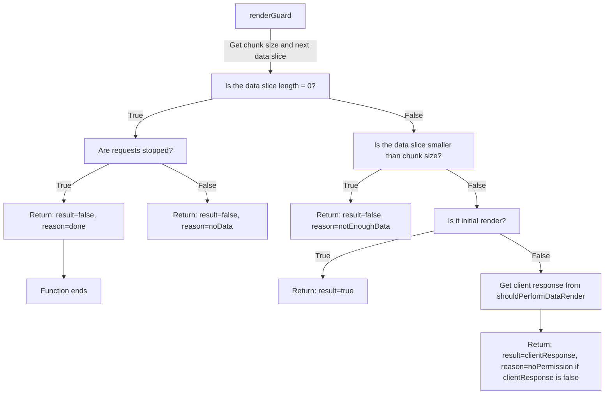
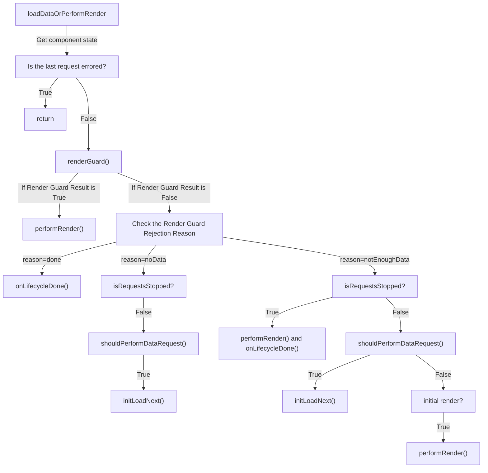

# components/base/b-virtual-scroll

The `b-virtual-scroll` component is designed for rendering a large array of various data.

## Synopsis

* The component extends [[iData]].

* The component implements [[iItems]] traits.

* By default, the component's root tag is set to `<div>`.

## Modifiers

See the implemented modifiers or the parent component.

## Events

| EventName                       | Description                                                     | Payload description                           | Payload                     |
| ------------------------------- | --------------------------------------------------------------- | --------------------------------------------- | --------------------------- |
| `dataLoadSuccess`               | Data loading has succeeded.                                     | `data: object[], isInitialLoading: boolean`   | `[data, isInitialLoading]`  |
| `dataLoadStart`                 | Data loading has started.                                       | `isInitialLoading: boolean`                   | `[isInitialLoading]`        |
| `dataLoadError`                 | An error occurred while loading data.                           | `isInitialLoading: boolean`                   | `[isInitialLoading]`        |
| `dataLoadEmpty`                     | Successful load with no data.                                   |                                               | `[]`                        |
| `resetState`                    | Reset component state.                                          |                                               | `[]`                        |
| `lifecycleDone`                 | All component data is rendered and loaded.                      |                                               | `[]`                        |
| `convertDataToDB`               | Trigger data conversion to the `DB`.                            | `data: unknown`                               | `[data]`                    |
| `elementEnter`                  | The element has entered the viewport.                           | `componentItem: MountedChild`                 | `[componentItem]`           |
| `renderStart`                   | Rendering of items has started.                                 |                                               | `[]`                        |
| `renderDone`                    | Rendering of items has finished.                                |                                               | `[]`                        |
| `renderEngineStart`             | Rendering of items has started with the render engine.          |                                               | `[]`                        |
| `renderEngineDone`              | Rendering of items has finished with the render engine.         |                                               | `[]`                        |
| `domInsertStart`                | DOM node insertion has started.                                 |                                               | `[]`                        |
| `domInsertDone`                 | DOM node insertion has finished.                                |                                               | `[]`                        |

Also, you can see the implemented traits or the parent component.

## Usage

### Converting Data to the Required Format

The `b-virtual-scroll` component expects data in a specific format:

```typescript
interface VirtualScrollDb {
  data: unknown[];
}
```

The `data` array should contain the data items used to render the components.
The `dbConverter` prop allows you to convert data into a format suitable for `b-virtual-scroll` after data has been loaded.

```
< b-virtual-scroll &
  ...
  :dbConverter = (data) => ({data: data.nestedData.data})
.
  < template #loader
    < .&__loader
      Data loading in progress
```

### Rendering Components

```
< b-virtual-scroll &
  :dataProvider = 'Provider' |
  :request = {get: {chunkSize: 12}} |
  :requestQuery = (state) => ({page: state.loadPage}) |
  :chunkSize = 12 |
  :item = 'b-dummy' |
  :itemProps = (data) => ({name: data.name, type: data.type})
.
  < template #loader
    < .&__loader
      Data loading in progress
```

In this example:

- The `b-virtual-scroll` component is used to render 12 items per one render cycle.
It interacts with the `Provider` data provider to fetch the data. The `request` prop is set to `{ get: { chunkSize: 12 } }`, specifying that each request should fetch 12 items.
- The `requestQuery` function computes additional request parameters based on the component state, specifically the `loadPage` property. These request parameters are merged with the `request` prop.
- The `b-virtual-scroll` component renders `b-dummy` components using the `item` prop.
Each `b-dummy` component receives the `name` and `type` props, which are derived from the `data` object for each item using the `itemProps` function.
- The component includes a `loader` slot that displays the message "Data loading in progress" while the data is being fetched.
- By default, the component stops loading data when it receives an empty response from the `dataProvider`, indicating that there are no more items to load.

### Rendering on click

In addition to the standard scroll-based loading, you can implement on-demand loading.

To achieve this, you need to disable the observer module, allow component rendering, and use the special `initLoadNext` method.

```
< b-virtual-scroll &
  :disableObserver = true |
  :shouldPerformDataRender = () => true |
  ref = scroll
.
```

```typescript
class pSomePage {
  @watch('something')
  onSomething() {
    this.$refs.scroll.initLoadNext();
  }
}
```

Additionally, for ease of implementation, when you need to load and render data on a button click, the `renderNext` slot is available. It will be displayed only when the component is not loading data, the last load did not result in an error, and the component's lifecycle is not completed. In combination with the `initLoadNext` method, this allows for easy implementation of lazy rendering on button click.

```
< b-virtual-scroll &
  :disableObserver = true |
  :shouldPerformDataRender = () => true |
  ref = scroll
.
  < template #renderNext
    < .&__render-next @click = $refs.scroll.initLoadNext
      Render next
```

### Component Reload

To reload the `b-virtual-scroll` component, you have several options:

1. Call `bVirtualScroll.initLoad()`.
2. Call `bVirtualScroll.reload()`.
3. Modify the `request` prop.
4. Trigger a global event of type `reset`.

In all of these cases, the component's lifecycle will be reset to its initial state, and the component will start rendering new data, discarding any previous data.

## Slots

The component supports several slots for customization:

1. The `loader` slot allows you to display different content (usually skeletons) while the data is being loaded.

```
< b-virtual-scroll
  < template #loader
    < .&__loader
      Data loading in progress
```

2. The `tombstone` slot allows you to display different content (usually skeletons) that will be repeated `tombstonesSize` times while the data is being loaded.

```
< b-virtual-scroll :tombstonesSize = 3
  < template #tombstone
    < .&__skeleton
      Skeleton
```

3. The `retry` slot allows you to display different content (usually a prompt to retry loading data) when there is an error in data loading.

```
< b-virtual-scroll
  < template #retry
    < .&__retry @click = initLoad
      Retry last request
```

4. The `empty` slot allows you to display different content when the component receives an empty data set during the initial loading.

```
< b-virtual-scroll
  < template #empty
    < .&__empty
      No data
```

5. The `done` slot allows you to display different content when the component has finished loading and rendering all the data. The `done` slot
will be displayed after `lifecycleDone` event is fired.

```
< b-virtual-scroll
  < template #done
    < .&__done
      Load and render complete
```

6. The `renderNext` slot allows you to display different content when the component is not loading data and has not entered the lifecycle completion state.
This slot can be useful when implementing lazy content rendering on button click.

```
< b-virtual-scroll
  < template #renderNext
    < .&__render-next
      Render next
```

## API

### `shouldPerformDataRender`

- Type: `Function`
- Default: `(state: VirtualScrollState) => state.isInitialRender || state.itemsTillEnd === 0`

This function is called in the `bVirtualScroll.renderGuard` after other checks are completed.
It receives the component state as input and determines whether the component should render the next chunk of components.
The function should return a boolean value: `true` to allow the rendering of the next chunk, or `false` to prevent it.

Example usage:

```typescript
const shouldPerformDataRender = (state: VirtualScrollState): boolean => {
  return state.isInitialRender || state.itemsTillEnd === 0;
};
```

### `shouldPerformDataRequest`

- Type: `Function`
- Default: `(state: VirtualScrollState) => state.lastLoadedData.length > 0`

The `shouldPerformDataRequest` property of `bVirtualScroll` allows you to control whether the component should request additional data based on the component state.
This function allows the component to understand whether the data loading lifecycle is complete or not.

Here's an example of how you can use `shouldPerformDataRequest`:

```typescript
const shouldPerformDataRequest = (state: VirtualScrollState): boolean => {
  // Example: Request data if the remaining items till the end is less than or equal to 10
  return state.itemsTillEnd <= 10;
};
```

In this example, the function checks the `itemsTillEnd` property of the component state.
If the remaining number of items till the end is less than or equal to 10, it returns `true` to indicate that the component should perform a data request.
You can adjust the condition based on your specific requirements.

By implementing the `shouldPerformDataRequest` function, you have control over when the component should request additional data.
This allows you to customize the data loading behavior based on the state of the component.

### `shouldStopRequestingData`

- Type: `Function`
- Default: `(state: VirtualScrollState) => state.lastLoadedData.length > 0`

This function is called on each data loading cycle. It determines whether the component should stop requesting new data.
The function should return a boolean value: `true` to stop requesting data, or `false` to continue requesting data.

Here's an example of how you can use `shouldStopRequestingData`:

```typescript
const shouldStopRequestingData = (state: VirtualScrollState): boolean => {
  // Example: Stop requesting data when the total number of items equals the current number of loaded items
  return state.lastLoadedRawData?.total === state.data.length;
};
```

In this example, the function compares the total property of `lastLoadedRawData` with the length of the data array.
If the two values are equal, it returns true to indicate that the component should stop requesting new data.
This condition suggests that all available items have been loaded, and there is no need for further data requests.

You can customize the `shouldStopRequestingData` function to fit your specific scenario.
By implementing this function, you have control over when the component should stop requesting new data, based on the comparison between the total number of items and the current number of loaded items.

### `chunkSize`

- Type: `number | Function`
- Default: `10`

The amount of data required to perform one cycle of item rendering. This prop is used by the `bVirtualScroll` component to determine the number of components to render in each cycle.
It can be either a fixed number or a function that returns the number dynamically based on the component state.

Here are some examples:

```typescript
const chunkSize = (state: VirtualScrollState): number => {
  // Example 1: Incrementing chunk size for each render page
  return (state.renderPage + 1) * 10;

  // Example 2: Dynamic chunk size based on the state
  // Replace the condition and calculation with your custom logic
  if (state.isInitialRender) {
    return 20;
  } else if (state.renderPage < 3) {
    return 15;
  } else {
    return 10;
  }
};
```

In Example 1, the chunk size increases by 10 for each render page. For the initial render, it will be 10, then 20, 30, and so on.
In Example 2, the chunk size is dynamically determined based on the component state. It assigns different chunk sizes based on different conditions.

By using a function for `chunkSize`, you have the flexibility to adjust the rendering behavior based on the state of the component and other factors.

### `requestQuery`

- Type: `Function`
- Default: `undefined`

A function that returns the GET parameters for a request. This function is called for each request and receives the current component state as input.
It should return an object containing the request parameters. These parameters will be merged with the parameters from the `request` prop, giving priority to the `request` prop.

Pagination example:

```typescript
const requestQuery = (state: VirtualScrollState): Dictionary<Dictionary> => {
  return {
    get: {
      page: state.loadPage,
      limit: 10
      // Other pagination parameters
    }
  };
};
```

### `itemsFactory`

- Type: `Function`
- Default: See description

A factory function used to generate an array of `ComponentItem` objects representing the components to be rendered.
This function is called during the rendering process and receives the component state and context as arguments. It should return an array of `ComponentItem` objects.

The default implementation uses the `chunkSize` and `iItems` trait to slice the data and generate the components.
However, you can override this function to implement a custom rendering strategy.

Here's an example of how you can use the itemsFactory property to generate ComponentItem objects based on the lastLoadedData property:

```typescript
const itemsFactory = (state: VirtualScrollState): ComponentItem[] => {
  const items: ComponentItem[] = state.lastLoadedData.map((itemData, index) => {
    // Construct a ComponentItem object for each item in the lastLoadedData array
    return {
      type: 'item',
      item: 'b-button',
      props: {
        id: `button-${index}`
      },
      key: `item-${index}`,
      children: {
        default: `Item ${index + 1}`
      }
    };
  });

  return items;
};
```

### `tombstonesSize`

- Type: `number`
- Default: `undefined`

Specifies the number of times the `tombstone` component will be rendered. This prop can be useful if you want to render multiple `tombstone` components using a single specified element.
For example, if you set `tombstonesSize` to 3, then three `tombstone` components will be rendered on your page.

Note: The `tombstone` component is used to represent empty or unloaded components in the virtual scroll. It is rendered as a placeholder until the actual component data is loaded and rendered.

### Other Properties

The `bVirtualScroll` class extends `iData` and includes additional properties related to slots, component state, and observers. Please refer to the documentation of `iData` for more details on those properties.

## Migration from `b-virtual-scroll` version 3.x.x

### API

- Prop `renderGap` -> `shouldPerformDataRender`.
- Props with `option-like` -> `iItems` props.
- Method `getDataStateSnapshot` -> `getComponentState`.
- Method `reloadLast` -> `initLoadNext`.
- `VirtualItemEl` interface is removed. Now, the client receives a single data item in the `iItems` methods. To maintain logic with `current`, `prev`, `next`, you can use the following approach:

```typescript
function getProps(data: DataInterface, index: number): Dictionary {
  const
    state = this.$refs.scroll.getComponentState();

  const
    current = data,
    prev = state.data[index - 1],
    next = state.data[index + 1];
}
```

- Interface `DataState` -> `VirtualScrollState`:
  - `DataState.currentPage` -> `VirtualScrollState.loadPage`;
  - `DataState.lastLoadedChunk.raw` -> `VirtualScrollState.lastLoadedRaw`;
  - etc.

## Deep dive into the component

### Lifecycle

The component's lifecycle consists of several events and states. When the component is initialized and starts its initial data loading, it emits two events: `initLoadStart` and `dataLoadStart`. The `initLoadStart` event is a standard event emitted by every component and occurs each time the component's data is initially loaded. The `dataLoadStart` event is emitted for every data loading.

1. `initLoadStart` - The initial data loading of the component has started.
2. `dataLoadStart` - The data loading of the component has started.

After successful data loading, the following events are emitted:

1. `convertDataToDB` - The data conversion has been performed.
2. `initLoad` - The initial data loading of the component has completed.
3. `dataLoadSuccess` - The data loading of the component has completed.

When the `convertDataToDB` event is emitted, the component's state is already updated with the `lastLoadedRawData` field. The `initLoad` and `dataLoadSuccess` events are emitted after updating the component's state, including `VirtualScrollState.data`, `VirtualScrollState.loadPage`, and some other fields.

After successful data loading, the component consults the `shouldStopRequestingData` method to determine whether it should stop loading further data.

Next, the component invokes the `renderGuard` to determine if the data can be rendered or not. If the `renderGuard` allows rendering, the following events are emitted:

1. `renderStart` - The component rendering has started.
2. `renderEngineStart` - The component rendering using the rendering engine has started.
3. `renderEngineDone` - The component rendering using the rendering engine has completed.
4. `domInsertStart` - The DOM insertion has started.
5. `domInsertDone` - The DOM insertion has completed. This event is asynchronous as it uses RAF (Request Animation Frame) for DOM insertion.
6. `renderDone` - The component rendering has finished.

Afterward, the component waits for user actions, specifically when the user sees any component on the page. The component then calls the

`shouldPerformDataRequest` or `shouldPerformDataRender` functions on the client side, depending on the availability of data. This process repeats until all data has been loaded and rendered.

1. `lifecycleDone` - Occurs when all data has been loaded and rendered on the page.

### `renderGuard` and `loadDataOrPerformRender`

The `b-virtual-scroll` component relies on the `renderGuard` and `loadDataOrPerformRender` functions to determine whether to render data, load data, or complete the component's lifecycle.

The `loadDataOrPerformRender` function is the entry point for the data loading and rendering cycle.
This function consults the `renderGuard`, which determines whether data can be rendered based on the data state and provides reasons for rejection only if it has not permitted the rendering.

Understanding `renderGuard`:



Understanding `loadDataOrPerformRender`:



### Difference between ComponentItem with type `item` and `separator`

The component allows rendering two types of components:

- `item` - Main component (main content).
- `separator` - Other components, such as dividers or separators.

There is no significant difference between them, except that they are treated differently in fields like `itemsTillEnd` in the `VirtualScrollState`. As the name suggests, the `itemsTillEnd` property only considers components with the `item` type, while `childTillEnd` considers components with both `item` and `separator` types.

The distinction between `item` and `separator` types is mainly used for calculating certain properties based on the type of components present in the `VirtualScrollState`, such as the number of items till the end of the scroll.

### Overriding in Child Layers

The main use case for overriding in child layers is to modify the default behavior of functions or methods.

For example, it may be useful to override the logic of `shouldStopRequestingData` if you want to implement a default logic that takes into account the `total` field of the response when making a decision.

There may also be situations where you need to modify the `renderGuard`. Currently, the component loads data until the number of items reaches the `chunkSize` and then renders them. By overriding the `renderGuard`, you can achieve partial rendering, where the component renders the available data regardless of whether it reaches the `chunkSize`.

## What's Next

The component currently lacks some features that may improve its functionality and make it more suitable for different scenarios.

### Streaming Data Rendering

- Planned for implementation.

There is a request for streaming data rendering from the server.
This can be implemented using the standard V4 `dataProvider` API, but it requires further modifications to the component to handle streaming data events.

### Alternative Approach to Component Rendering

- Planned as an experiment.

Currently, the component uses the `iBlock.vdom` API, which creates a new rendering engine instance for each chunk.
It is hypothetically possible to reuse the rendering engine instead. However, there are challenges to consider.
For example, the Vue 3 rendering engine removes previously rendered DOM nodes and destroys components when attempting to use the rendering function and `forceUpdate` with a different VNode to render.

### Partial Rendering (can be achieved easily through `renderGuard`)

- Not planned for implementation.

Currently, the component loads data until the number of items reaches the `chunkSize` and then renders them. By overriding the `renderGuard`, you can achieve partial rendering, where the component renders the available data regardless of whether it reaches the `chunkSize`.

### Updating Nodes in the DOM Tree (describe implementation challenges, component allows inserting different components)

- Planned as an experiment.

Currently, `b-virtual-scroll` does not remove old nodes when rendering new chunks within the same lifecycle. Implementing this feature is not a priority, but it should not be ignored either. The main reasons why this feature was not included in the initial release are:

- Previous experiments showed no performance degradation after rendering and inserting 30x(5-8) components into the DOM tree.
- The inability to reuse DOM nodes: typical components allow reusing DOM nodes, but `b-virtual-scroll` enables clients to easily render different components. It is important to note that reusing DOM nodes provides the greatest benefit, not just simple insertion/removal of entire sections from the DOM tree.
- The need to implement two-way data rendering: Since memory is limited, storing a large number of rendered components in memory is not ideal. This requires destroying previously rendered components and then rendering them again. However, this approach can cause delays when scrolling back up.
- Since scroll events need to be used to render data, additional heuristics or props indicating the scroll direction and the number of columns being rendered may need to be added to correctly maintain the node map.

### Integration with RTX

- High priority.

Why have `b-virtual-scroll` without RTX?
